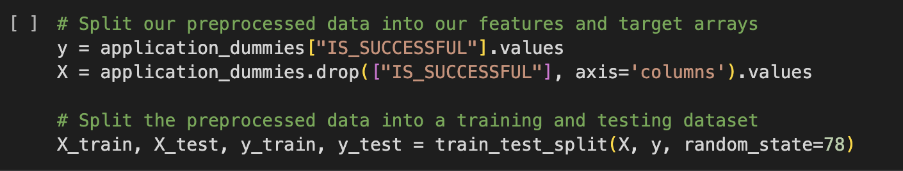
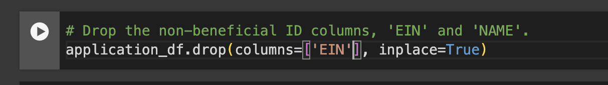

# deep-learning-challenge

## Overview of the Analysis

* This challenge seeks to create a tool to help select applicants for funding. Using a given dataset and creating a binary classifier, the tool will be used to select applicants who have the best chance of success in their ventures.  

## Results

### Data Preprocessing
* The feature variable for the model is IS_SUCCESSFUL.

* The targets for the model:
    1. NAME
    2. APPLICATION TYPE
    3. AFFILIATION
    4. CLASSIFICATION
    5. USE_CASE
    6. ORGANIZATION
    7. STATUS
    8. INCOME_AMT
    9. SPECIAL_CONSIDERATIONS
    10. ASK_AMT
    

* `EIN` was removed as a non-beneficial column.

### Compiling, Training, Evaluating the Model
* 65 neurons were used between three layes. Tanh activation was used for the first two layers and Relu was used for the third layer. The output layer used the Sigmoid activation. 

* The target model performed 

Two layers were initially used with about twice as many neurons in the first layer than the second. In an attempt to increase the accuracy of the model a third layer was added. 
The `EIN` and `NAME` columns were removed during the initial attempts of running the model. Upon adding the third hidden layer, the `NAME` column was also added in hopes of improving accuracy. 

## Summary

* I do not recommend using this model.

